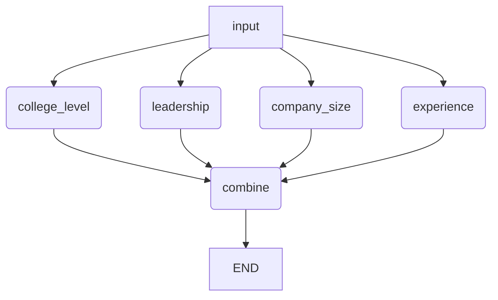

# SearchRight 기술 과제

이 프로젝트는 FastAPI로 구축된 백엔드 애플리케이션으로, 회사 정보, 뉴스 기사를 관리하고 프로파일링 기능을 제공하도록 설계되었습니다. 효율적인 벡터 유사성 검색을 위해 `pgvector`가 포함된 PostgreSQL, 컨테이너화를 위한 Docker, 리버스 프록시로 Nginx를 활용합니다.

## 기능

*   **회사 관리:** 회사 데이터에 대한 CRUD 작업.
*   **회사 뉴스 관리:** 의미론적 검색을 위한 임베딩 생성을 포함하여 회사 뉴스 기사 저장 및 검색.
*   **프로파일링:** 회사 및 뉴스 데이터를 기반으로 프로필 생성.
*   **벡터 검색:** 뉴스 임베딩에 대한 유사성 검색을 위해 `pgvector` 활용.

## 사용 기술

*   **백엔드 프레임워크:** FastAPI
*   **데이터베이스:** `pgvector` 확장 기능이 있는 PostgreSQL
*   **의존성 관리:** Poetry
*   **컨테이너화:** Docker, Docker Compose
*   **웹 서버:** Nginx
*   **AI/ML:** OpenAI, Langchain, LangGraph
*   **웹 스크래핑:** `trafilatura`

## 설정 및 설치

### 전제 조건

*   Docker 및 Docker Compose
*   Python 3.13+
*   Poetry

### 단계
1.  **저장소 복제:**
    ```bash
    git clone https://github.com/your-repo/searchright-technical-assignment.git
    cd searchright-technical-assignment
    ```

2.  **Docker 컨테이너 빌드 및 실행:**
    ```bash
    docker-compose up --build -d
    ```
    이렇게 하면 Nginx 및 PostgreSQL (pgvector 포함) 컨테이너가 시작됩니다.

3.  **Poetry 가상 환경 활성화 및 의존성 설치:**
    Poetry 가상 환경을 활성화하고 필요한 Python 의존성을 설치합니다.
    ```bash
    poetry env activate
    poetry install
    ```
    (참고: `poetry install`은 가상 환경 활성화 후 한 번만 실행하면 됩니다. 이미 설치된 경우 생략 가능합니다.)

5.  **데이터베이스 테이블 설정:**
    ```bash
    python -m searchright_technical_assignment.db.setup_tables
    ```

6.  **FastAPI 애플리케이션 실행:**
    ```bash
    uvicorn searchright_technical_assignment.main:app --host 0.0.0.0 --port 8000 --reload
    ```
    또는 Poetry 셸 내에서 실행하는 경우:
    ```bash
    python searchright_technical_assignment/main.py
    ```

API는 `http://localhost:8000`에서 접근할 수 있습니다.
API 문서 (Swagger UI)는 `http://localhost:8000/docs`에서 사용할 수 있습니다.

## API 엔드포인트

애플리케이션은 다음 주요 API 경로를 노출합니다:

*   `/company`: 회사 정보 관리를 위한 경로.
*   `/companynews`: 임베딩 생성 및 검색을 포함한 회사 뉴스 기사 관리를 위한 경로.
*   `/profiling`: 인재 프로필 생성을 위한 경로.

자세한 엔드포인트 사양은 Swagger UI (`http://localhost:8000/docs`)를 참조하십시오.

## 프로젝트 구조

```
.
├── .git/
├── .gitignore
├── .python-version
├── docker-compose.yaml
├── poetry.lock
├── pyproject.toml
├── README.md
├── test_embedding.py
├── example_datas/             # 샘플 데이터 및 데이터 설정 스크립트
├── nginx/                     # Nginx 설정
├── searchright_technical_assignment/
│   ├── main.py                # 메인 FastAPI 애플리케이션 진입점
│   ├── crud/                  # 데이터베이스 모델에 대한 CRUD 작업
│   ├── db/                    # 데이터베이스 설정 및 데이터 삽입 스크립트
│   ├── image/                 # 프로젝트 이미지
│   ├── model/                 # SQLAlchemy 모델
│   ├── node/                  # 프로파일링 워크플로우를 위한 그래프 노드
│   ├── prompt/                # AI 모델을 위한 프롬프트 템플릿
│   ├── retriever/             # 데이터 검색 로직 (예: pgvector)
│   ├── router/                # API 엔드포인트를 위한 FastAPI 라우터
│   ├── schema/                # 요청/응답 유효성 검사를 위한 Pydantic 스키마
│   ├── state/                 # 프로파일링 워크플로우를 위한 상태 관리
│   ├── util/                  # 유틸리티 함수 (임베딩, 데이터 추출 등)
│   └── workflows/             # LangGraph 워크플로우 (예: 프로파일링)
│       └── profiling_workflow.py # 인재 프로파일링을 위한 LangGraph 워크플로우 정의
│           # LangGraph 노드 설명:
│           # - input: 워크플로우의 시작 노드로, 초기 상태를 다음 노드로 전달합니다.
│           # - college_level: 지원자의 학력 정보를 기반으로 대학 수준을 판단합니다.
│           # - leadership: 지원자의 기술 및 직책 정보를 기반으로 리더십 유무를 판단합니다.
│           # - company_size: 지원자의 경력 회사 정보를 기반으로 회사 규모(스타트업/대기업)를 판단합니다.
│           # - experience: 지원자의 경력 설명을 기반으로 경험을 판단합니다.
│           # - combine: 다양한 노드에서 생성된 프로파일링 정보를 결합하여 최종 프로파일을 생성합니다.
└── tests/                     # 단위 및 통합 테스트
```

## LangGraph 워크플로우

`profiling_workflow.py`에 정의된 LangGraph 워크플로우는 다음과 같은 흐름을 가집니다:



**노드 설명:**
*   `input`: 워크플로우의 시작 노드로, 초기 상태를 다음 노드로 전달합니다.
*   `college_level`: 지원자의 학력 정보를 기반으로 대학 수준을 판단합니다.
*   `leadership`: 지원자의 기술 및 직책 정보를 기반으로 리더십 유무를 판단합니다.
*   `company_size`: 지원자의 경력 회사 정보를 기반으로 회사 규모(스타트업/대기업)를 판단합니다.
*   `experience`: 지원자의 경력 설명을 기반으로 경험을 판단합니다.
*   `combine`: 다양한 노드에서 생성된 프로파일링 정보를 결합하여 최종 프로파일을 생성합니다.


## 어려웠던 점
**크롤링** 

1. 인코딩 문제 (`jndn.com`): 
    
    특히 HTML 소스 코드에 charset=euc-kr로 명시되어 있지만, chardet는 utf-8로 감지. 웹사이트자체의 인코딩 설정이 올바르지 않을 가능성이 크다.
    
    - 해결 방안 
        
        chardet 라이브러리를 사용하여 웹사이트의 인코딩을 자동으로 감지하고 처리하도록 스크립트를 개선 (UTF-8, EUC-KR, CP949 외의 다른 인코딩을 사용하는 사이트도 처리 가능)
    
2. SSL/TLS 오류 (`vop.co.kr`): 
    
    오래된 보안 프로토콜을 사용하여 접속이 차단
    
    예시: http://www.upinews.kr/newsView/upi202303310046, https://thesocial.news/...
    
    - 원인: 
  
        DNS 확인 실패, 해당 호스트가 존재하지 않거나, 서버가 다운되었거나, 방화벽 등으로 인해 접근이 차단되었을 때 발생 즉, 해당 URL의 서버를 찾거나 연결할 수 없다는 의미
    - 해결 방안
        1. URL 유효성 확인: 
            
            해당 URL이 현재도 유효한지 웹 브라우저에서 직접 접속하여 확인, 링크가 깨졌거나, 기사가 삭제되었을 수 있습니다.

        2. 네트워크 연결 확인: 
            
            본인의 인터넷 연결 상태를 확인

        3. 사이트 차단: 
            
            해당 웹사이트가 스크래핑 시도를 감지하고 IP를 차단했을 수도 있습니다. 이 경우, 프록시 사용을 고려해볼 수 있습니다.
        
3. 과다 추출 문제 (`lawtimes.co.kr`): 
    
    뉴스 본문을 제외한 Nav Bar의 내용이나 Side Bar 내용까지 추출
    
    - 해결 방안
       
       1. favor_precision=True를 사용하여 더 엄격하게 추출
        
            → 일부 사이트에서 한글이 깨져서 추출하는 문제 발생 (인코딩 문제)
                
            특히 HTML 소스 코드에 charset=euc-kr로 명시되어 있지만, chardet는 utf-8로 감지. 웹사이트자체의 인코딩 설정이 올바르지 않을 가능성이 크다.
            
            예시) https://www.insnews.co.kr/design_php/news_view.php?num=81603&firstsec=1&secondsec=11
    
4. 서버 오류 (`news.dealsitetv.com`): 
    
    웹사이트 서버 자체의 문제 (사라진 뉴스 기사 페이지)